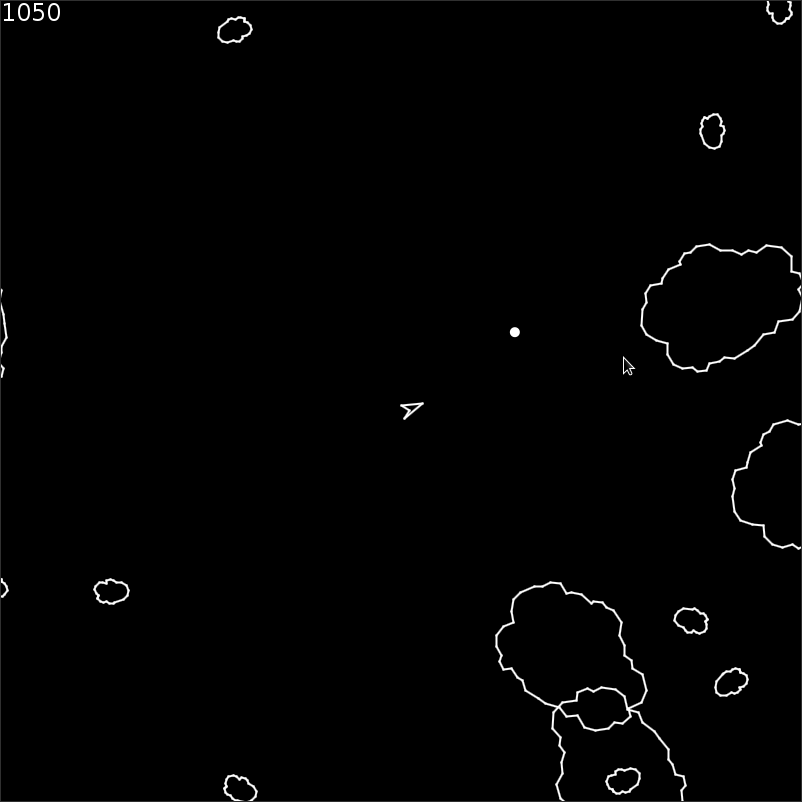
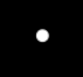
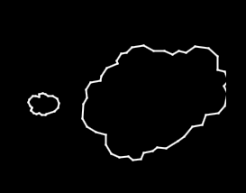
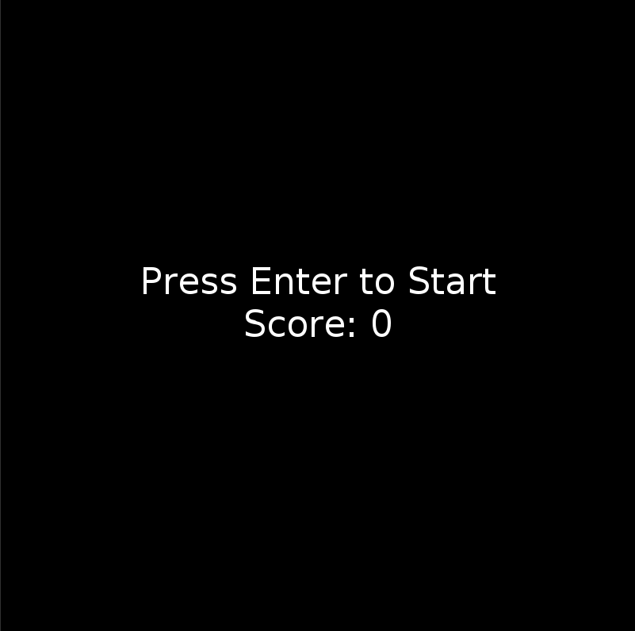

# Studienleistung III: GraphicsApp | Asteroids

## Allgemeine Hinweise zur Studienleistung
In dieser Studienleistung werden Sie eine Programmieraufgabe lösen.
Diese Programmieraufgaben besteht aus einem Projekt
* ```Studienleistung-III-Asteroids```

Nutzen Sie zum Lösen der Aufgabe die bereitgestellte Klassendatei als Einstiegspunkt und fügen Sie weitere Klassen nach Bedarf hinzu.
Zum Einreichen Ihrer Aufgabe nutzen Sie die entsprechende Funktion in GRIPS.
Falls Sie Problemen mit dem Starterpaket oder dem Einreichen der Aufgabe haben, können Sie sich in den Handouts auf GRIPS informieren.

Achtung: Eine Verlängerung der Abgabefrist ist nicht möglich.
Einreichungen, die uns (zu spät) per E-Mail erreichen, werden nicht mehr berücksichtigt.
Alle nicht eingereichten Aufgaben werden mit nicht bestanden bewertet.
Testen Sie den Upload am besten schon vor Ablauf der Frist in Ruhe: Sie können bis zum Abgabetermin beliebig viele neue Lösungen einreichen.

Bewertungskriterien: Für die gesamte Studienleistung gilt, dass die eingereichten Lösungen nur die in der Aufgabenstellung beschriebenen Probleme lösen sollen.
Lassen Sie keinen Teil der jeweiligen Aufgabe weg und interpretieren Sie die Fragestellung nicht selbstständig.
Bewertet wird, inwieweit Sie das beschriebene Problem vollständig lösen.
Wenn Sie die Aufgaben erfolgreich bearbeitet haben, können Sie Ihre Lösung gerne kreativ gestalten und erweitern; achten Sie dabei darauf, dass die eigentlichen Anforderungen weiterhin erfüllt bleiben.
Die Qualität Ihres Codes fließt in die Gesamtnote mit ein: Nutzen Sie Decomposition um Ihre Programme übersichtlich zu gestalten.
Verwenden Sie sinnvolle Bezeichner für Variablen und Methoden und kommentieren Sie ausreichend.
Beachten Sie dazu die Kriterien für guten und schlechten Code, die in der Vorlesung erwähnt wurden.

Sollten Sie Fragen haben oder Hilfe brauchen, können Sie im Discord uns eine Nachricht hinterlassen.
Wir stehen Ihnen dann zeitnah zur Seite über eine Direktnachricht.

# Simple Asteroids

## Ausgangslage
Im Rahmen dieser Aufgabe implementieren Sie einen Klon des bekannten Retro-Spiels Asteroids.



Die Ausgangsbedingung für diese Aufgabe ist wie folgt:

Sie implementieren ausgehend von einer leeren `GraphicsApp` anhand der gegebenen Klassen `Entity`, `Util` und `Contants` das Spiel Asteroids.

## Anforderungen
Folgende Anforderungen muss Asteroids erfüllen:
* Sie müssen die gegebenen Klassen `Entity`, `Util` und `Contants` verwenden (z.B. durch Vererbung, Aufruf statischer Methoden, etc.), um Asteroids zu implementieren
* Weltraum
  * Alle Spielelemente (Schiff, Asterioden, Bullets) fliegen im Weltraum, welcher durch die Zeichenfläche der `GraphicsApp` begrenzt ist
  * Bewegt sich ein Spielelement vollständig aus der Zeichenfläche so bewegt es sich auf der gegenüberliegenden Seite wieder in die Zeichenfläche hinein
    * Je nachdem über welche Kante das Spielelement die Zeichenfläche verlässt muss entschieden werden, wie es auf der gegenüberliegenden Seite wieder die Zeichenfläche betritt
    * Bei den Kanten links und rechts bleibt u.a. die `y`-Position des Spielelements identisch
    * Bei den Kanten oben und unten bleibt u.a. die `x`-Position des Spielelements identisch
* Spielelemente
  * Schiff
    * **Für die Implementierung des Schiffs erstellen Sie eine Klasse, die `Ship` heißen muss, damit Sie eine bestimmte Methode der Klasse `Util` verwenden können**
    * Das Schiff besteht aus Objekten der Klasse `Line` der `GraphicsApp`, welche in einem Objekt der Klasse `Compound` der `GraphicsApp` zusammengefasst werden. Benutzen Sie dafür die entsprechende Konstante in `Constants`
    
    
    
    * Das Schiff wird mit den Pfeiltasten gesteuert
      * Pfeiltaste Oben: Das Schiff bewegt sich mit fester Geschwindigkeit in die Richtung, in die das Schiff zeigt
      * Pfeiltaste Links: Das Schiff rotiert nach links
      * Pfeiltaste Rechts: Das Schiff rotiert nach rechts
    * Da das Spiel im Weltraum stattfindet, schwebt das Schiff weiter in die letzte Flugrichtung 
    * Dieser Schwebe-Effekt, wie im Begleitvideo dargestellt, sorgt dafür, dass das Schiff nicht ad-hoc seine Flugrichtung ändern kann, sondern einen Bogen fliegen muss, weil das Schiff immer gerade aus Schub ausübt und die Rotation über Zeit stattfindet:
      * Über mehrere Frames (Aufrufe der `draw()`-Methode) muss das Schiff gleichzeitig rotiert und bewegt werden, um eine Kurve zu fliegen
      * Daher legt das Schiff einen Bogen zurück, weil das Schiff nach wie vor in die letzte Bewegungsrichtung schwebt
    * Das Schiff wird bei Kontakt mit Asteroiden zerstört und das Spiel endet (`hitTest`-Methode)
    * Das Schiff kann `Bullets` in die Richtung, **in die es zeigt**, abfeuern

  * Bullets
    * Bullets sind kreisförmig

    

    * Bullets sollen mithilfe von `Entity` implementiert werden
    * Bullets werden durch einmaliges betätigen der `Leertaste (Spacebar` vom Schiff in die Richtung, **in die das Schiff zeigt**, abgefeuert 
        * Das Schiff soll nur einmal bei Betätigung der `Leertaste` ein `Bullet` abfeuern.
        * Das Gedrückthalten der `Leertaste` soll kein Dauerfeuer zur Folge haben
        * Jeder Schuss ist demnach einmaliges Drücken der `Leertaste`
    * Bullets haben eine Lebensdauer von `x` Sekunden (z.B. 1) ehe sie verschwinden
    * Es können beliebig viele Bullets im Weltraum gleichzeitig existieren; diese Zahl ist nur dadurch limitiert, wie schnell eine spielende Person die `Leertaste` hintereinander drücken kann
    * Ein Bullet zerstört einen Asteroiden bei einem Treffer (`hitTest`-Methode); nach einem Treffer verschwindet das Bullet, sowie der Asteroid
  * Asteroiden
    * Asteroiden sollen mithilfe von `Entity` implementiert werden
    * Ein Asteroid besteht, je nach Größe, aus Objekten der Klasse `Line` der `GraphicsApp`, welche in einem Objekt der Klasse `Compound` der `GraphicsApp` zusammengefasst werden. Benutzen Sie dafür die entsprechende Konstante in `Constants`

    
  
    * Asteroiden sollen alle `y` Sekunden (z.B. 1) erscheinen
    * Es soll beim Erscheinen (Spawn) eines Asteroiden zufällig gewürfelt werden
      * ob dieser groß oder klein ist
      * an welcher Position dieser erscheint, aber nicht zu nah am Schiff
      	* benutzen Sie eine Methode `distance` der gegebenen `Util`-Klasse, um herauszufinden, ob ein Asteroid zu nah am Schiff erscheinen würde
      	* verwenden Sie die Konstante `MIN_SPAWN_DISTANCE_ASTEROID` der Klasse `Constants`
      	* "schieben" Sie den Asteroid weiter vom Schiff weg, sofern der Mindestabstand nicht eingehalten ist
      * in welche Richtung sich dieser bewegt 
      * und um welchen Winkel dieser um seinen Mittelpunkt rotiert
    * Es sollen nicht mehr als `z` Asteroiden (z.B. 10) gleichzeitig existieren können
    * Asteroiden werden durch einen Treffer mit einem Bullet zerstört (`hitTest`-Methode); der Asteroid und das Bullet verschwindet daraufhin
    * Abhängig von der Größe geben abgeschossene Asteroiden eine Anzahl von Punkten `a` oder `b` (z.B. 50 Punkte für einen großen Asteroiden (weil einfaches Ziel) und 150 Punkte für einen kleinen Asteroiden (weil schwieriges Ziel)), die auf den bisherigen Punktestand aufaddiert werden
* User Interface
  * Score
    * Zu jedem Zeitpunkt soll während eines laufenden Spiels der aktuelle Punktestand (`Score`) sichtbar sein (z.B. in der linken oberen Ecke)
    * Der Score updated sich, sobald neue Punkte erreicht wurden, das heißt ein Asteroid abgeschossen wurde, in dem die neuen Punkte aufaddiert werden auf den alten Score
    * Verwenden Sie die Klasse `Label` der `GraphicsApp`, um Score anzuzeigen
  * Game-Start- / Game-Over-Screen
    * Beim erstmaligen Start des Spiels ist ein Screen dieser Art sichtbar:

    

    * Durch Drücken der Taste `Enter` auf der Tastatur wird das Spiel gestartet
    * Sobald das Schiff zerstört wurde, also mit einem Asteroiden zusammengestoßen ist, erscheint ein Screen dieser Art:

    

    * Hier kann die spielende Person den erreichten Score nachlesen und das Spiel mit Drücken der `Enter`-Taste auf der Tastatur zurücksetzen und erneut starten

## Hinweise
* Strukturieren Sie Ihr Programm sinnvoll
  * Schreiben Sie sinnvolle eigene `Klassen` und achten Sie darauf, ob eine von Ihnen implementierte Klasse von einer anderen oder gegebenen Klasse erben soll oder diese andere Klasse benutzen soll (Vererbung vs. Kompositon)
  * Verwenden Sie `Datenstrukturen` deren Einsatz sinnvoll für das Problem sind, dass Sie mit diesen lösen wollen
  * Implementieren Sie `Interfaces`, um andere Objekte zu benachrichtigen, ob ein Bullet einen Asteroiden getroffen hat oder ob ein Bullet noch existiert
  * Legen Sie großen Wert auf `Decomposition` und vermeiden Sie `duplicate Code`
  * Analysieren Sie die Anforderungen genau und leiten Sie entsprechende Teilprobleme ab, die Sie
    * gekapselt implementieren können
    * iterativ testen können
    * verwenden können, um Ihren Implementierungsfortschritt zu verfolgen, um nach Pausen, die Arbeit wieder aufnehmen zu können
* Legen Sie großen Wert darauf den gegebenen Code in den Klassen `Entity`, `Util` und `Constants` zu lesen und zu verstehen, damit Sie diesen optimal in Ihr Asteroids-Spiel einbauen können
* Für den Schwebe-Effekt und die Schussrichtung des Schiffes müssen Sie Vektorgeometrie einsetzen; recherchieren Sie dazu nochmal in Richtung:
  * Richtungsvektoren
  * Bestimmung der Länge von Vektoren
  * Normalisierung von Vektoren
  * Benutzen Sie Klasse `Point` der `GraphicsApp` um einen Vektor in Ihrem Code zu repräsentieren
  * Probieren Sie verschiedene Werte aus mit denen Sie eine neue Richtung des Schiffs multiplizieren, damit sich die bisherige 'Float'-Richtung noch auf die Bewegung des Schiffes auswirkt
* Ziehen Sie die Dokumentation der `GraphicsApp` als Hilfsmittel heran (https://oop-regensburg.github.io/GraphicsApp-Reborn-Library/html/index.html)
* **Fangen Sie frühzeitig mit der Bearbeitung der Aufgabe an!**
  
## Ideen für Erweiterungen
```Wenn Sie die Aufgaben erfolgreich bearbeitet haben, können Sie Ihre Lösung gerne kreativ gestalten und erweitern; achten Sie dabei darauf, dass die eigentlichen Anforderungen weiterhin erfüllt bleiben.```
* Erweiterungen sind komplett optional
* Ideen für Erweiterungen:
  * Lassen Sie große Asteroiden in eine beliebige Anzahl (z.B. 4) kleiner Asteroiden zerfallen, sobald dieser abgeschossen wird
  * Bauen Sie Gegner ein, indem Sie eine neue Klasse (z.B. Enemy) hinzufügen, die von Entity erbt und auf den Spieler schießt
  * Implementieren Sie verschiedene Typen von Munition (z.B. Piercing, das alles durchschlägt, oder Heavy, das langsamer fliegt, aber einen großen Asteroiden ohne Kleine zu erzeugen, zerstören kann, etc.)
  * Bauen Sie einen Splash-Screen für Ihre AsteroidsApp ein
  * Implementieren Sie verschiedene Modifikatoren bzw. Multiplikatoren, der die erhaltenen Punkte pro Abschuss ändert
  * Implementieren Sie, dass das Schiff beschleunigt bis es eine Maximalgeschwindigkeit erreicht hat
  * Implementieren Sie ein HighScore-Board, dass Sie in einer Datei speichern und bei Programmstart auslesen
  * Implementieren Sie die Eingabe eines Namen, dem ein HighScore im HighScore-Board zugeordnet werden kann bei der Anzeige
  * etc.
